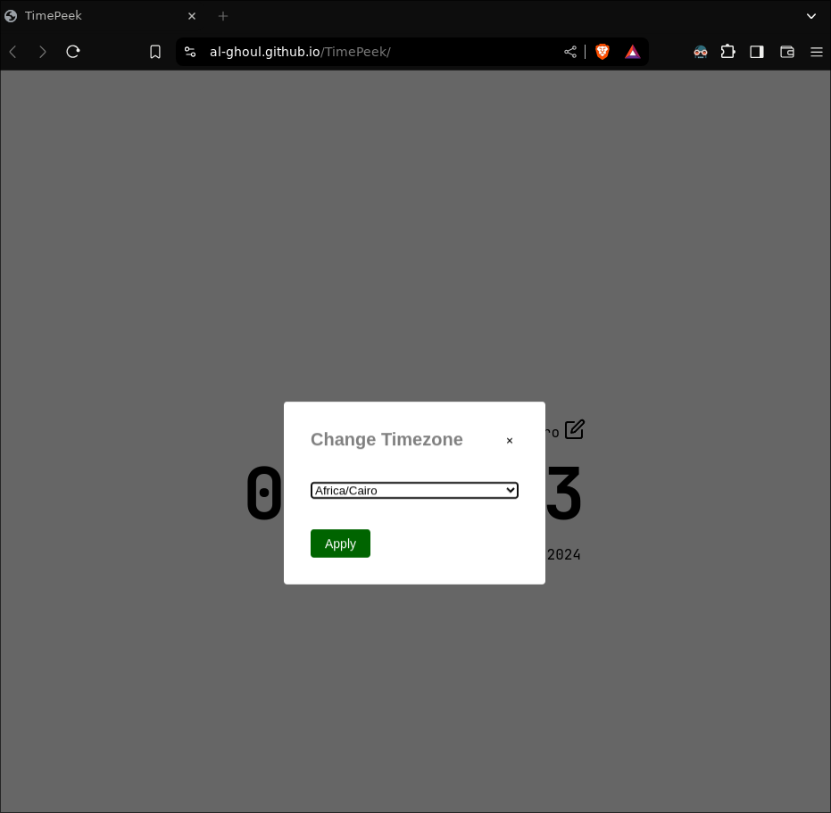

# Intro

This is a one page static/interactive time zone peek web app,
suggested by [Roadmap.sh](https://roadmap.sh/)'s [full stack roadmap](https://roadmap.sh/full-stack).

Live review at [al-ghoul.github.io/TimePeek/](https://al-ghoul.github.io/TimePeek/)

A snapshot of the site:

## Used Technologies

- [CSS](https://developer.mozilla.org/en-US/docs/Web/CSS)
- [HTML](https://developer.mozilla.org/en-US/docs/Web/HTML)
- [Yarn](https://yarnpkg.com/)

